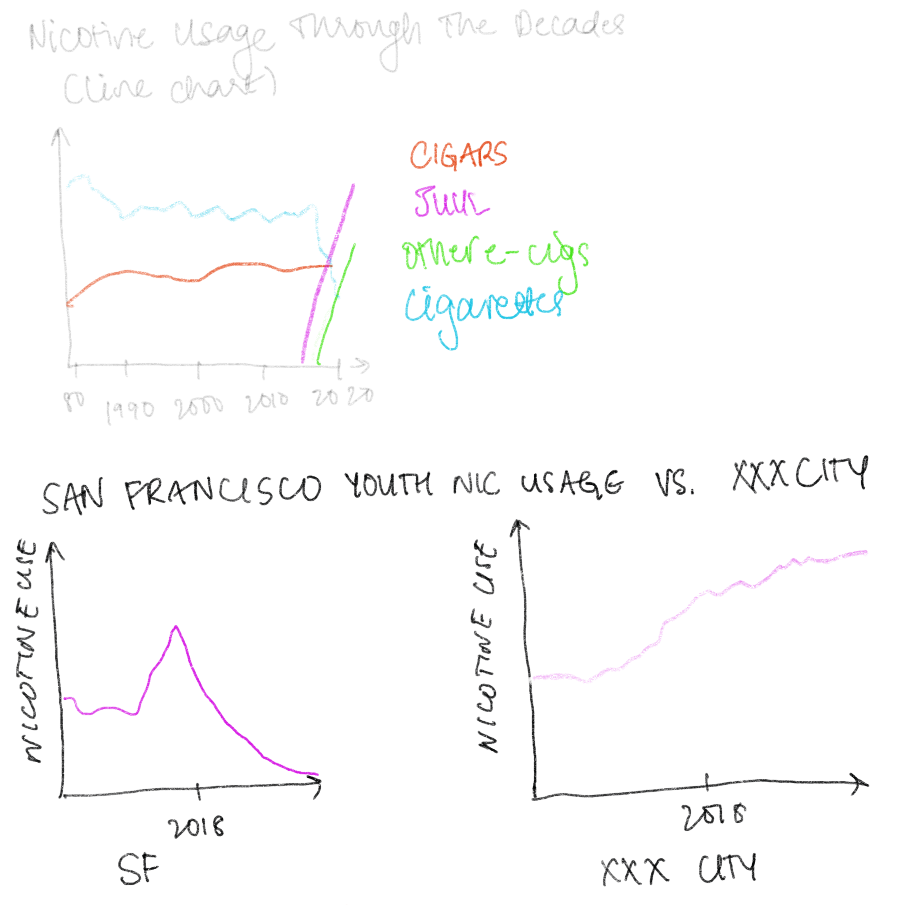

| [home page](https://kulmeher.github.io/TSWD-Repository/) | [visualizing government debt](https://kulmeher.github.io/TSWD-Repository/visualizing-government-debt.html)) | [critique by design](https://kulmeher.github.io/TSWD-Repository/critique-by-design.html) | [final project I](https://kulmeher.github.io/TSWD-Repository/final-project-part-one) | [final project II](https://kulmeher.github.io/TSWD-Repository/final-project-part-two) | [final project III](https://kulmeher.github.io/TSWD-Repository/final-project-part-three) |

# Final Project Part I: Rise in Teen Nicotine Addiction Due to E-Cigarettes 

#### Project Overview
For my final project, my current idea is to focus on an increase in youth nicotine usage as a result of e-cigarettes proliferating the market, targeting younger generations. To weave in the element of story with this data, I am currently thinking of illustrating the difference in youth nicotine useage through a comparison between two cities: San Francisco, where all flavored tobacco products were banned in 2018, with another city where flavored tobacco products are still widely available. In terms of finalizing the second city, I hoped to pick Pittsburgh, but may have to select a city in California, where it seems data is more easily avaiable on youth nicotine usage. The call to action will be to make the case for banning the sale of e-cigarettes and flavored tobacco products. 

#### Project Outline 
To outline this project, I began by thinking about who my audience is and who I want it to be. The topic of youth nicotine usage has some obvious stakeholders -- youth, parents, and schools, as well as doctors and public health profesisonals, and the tobacco industry at large. Though vaping has been framed as a potential path to quitting smoking, I want to tell a story about how vaping can lead to youth being more addicted to nicotine than they would have in it's absence. The audience for this story is people who can act to curb youth nicotine addiction spurred by flavored e-cigarettes -- policy makers and impacted individuals themselves.

Audience: Youth, Families, and Policy Makers

For this audience, I will be setting up my story via the following outline: 

Setup: Nicotine Addiction has been dropping across the world
Conflict: Flavored tobacco products are increasing youth nicotine usage
Resolution: Where flavored tobacco products and e-cigarettes are banned, this worrying trend can be reversed. 

#### Initial Sketches 

This is my visualization for what the setup of the public page will look like. 

This is my visualization for what the conflict of the public page will look like. 

This is my visualization for what the resolution of the public page will look like. 

#### Data Sources
There are a variety of data sources available. These data sources have a variety of data. Some have tables that I can recreate in Excel, others have .csv files ready for download. Still others will be utilized for high level data information, such as the percentage of teens who have used nicotine in a certain year. I hope to make use of one or more of the following:
- [Annual National Tobacco Youth Survey](https://www.fda.gov/tobacco-products/youth-and-tobacco/results-annual-national-youth-tobacco-survey)
- [Tobacco Product Use Among Middle and High School Students — United States, 2022 ]([https://www.cdc.gov/mmwr/volumes/71/wr/mm7145a1.htm?s_cid=mm7145a1_w)
- [Results of the California Teens Nicotine and Tobacco Project Online Survey 2021-2022](https://www.cdph.ca.gov/Programs/CCDPHP/DCDIC/CTCB/CDPH%20Document%20Library/ResearchandEvaluation/FactsandFigures/TNTOnlineSurveyWave-1-Report-2022_06_16%20-ADA.pdf)
- [Campaign for Tobacco Free Kids](https://www.tobaccofreekids.org/assets/factsheets/0416.pdf) - this link provides some context for other studies with contrary findings. 
- [Results of the Statewide 2019-2022 California Student Tobacco Survey](https://www.cdph.ca.gov/Programs/CCDPHP/DCDIC/CTCB/CDPH%20Document%20Library/ResearchandEvaluation/FactsandFigures/2019-20CSTSBiennialReport_7-27-2021.pdf)
- [Youth Tobacco Survey Data 1999-2017](https://catalog.data.gov/dataset/youth-tobacco-survey-yts-data)

These data sources will be used to draw information on current trends in e-cigarette usage for youth, compare them with previous trends (in years before the widespread advent of e-cigarettes) and compare two cities in terms of youth nicotine usage. This data will then be used to make the case for banning the sale of e-cigarettes statewide, to decrease youth cigarette usage. These data sources will also be used to demonstrate the methods utilized to ingest nicotine-- whether e-cigarettes, cigarettes, cigars, or other forms. 

#### Method and Medium 
As we go through this process, I envision using either Tableau or Flourish to create clean and upfront data visualizations. These data visualizations will then be displayed on a publically accessible website, created through Shorthand or through Esri's Story maps. The eventual medium chosen will depend on how the data visualizations can be best understood. 

